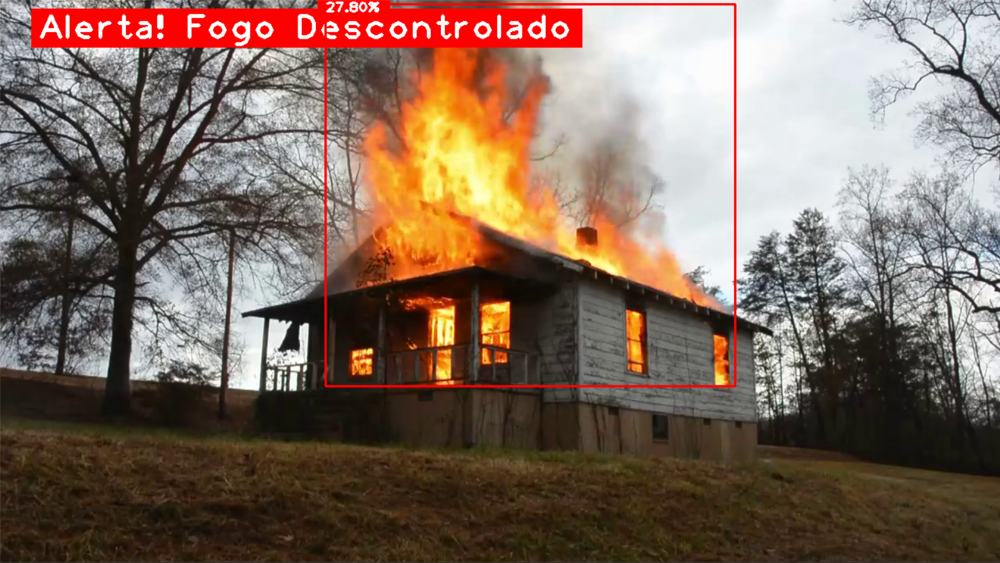
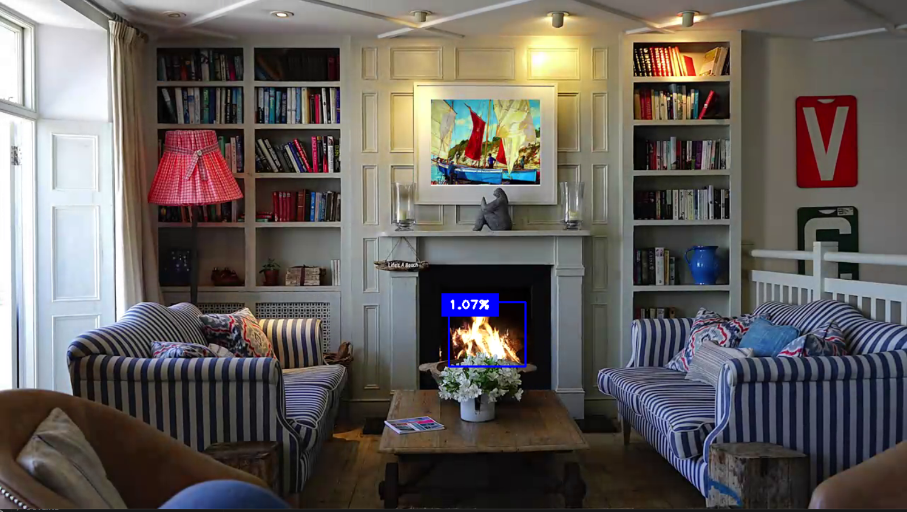

# 🔥 Detection Fire – Monitoramento Inteligente de Incêndios com YOLOv8 + OpenCV

  

**Detection Fire** é um sistema inteligente de monitoramento visual que une **YOLOv8 (Ultralytics)** e **OpenCV** para detecção automática de focos de incêndio em vídeos ou streams em tempo real.  
O sistema calcula a proporção do fogo em relação à cena e emite **alertas imediatos quando o fogo se torna descontrolado** (padrão: ≥ 5% do frame).  

🚀 Projeto ideal para **pesquisa, POCs e aplicações reais em segurança**.

---

## 📑 Índice

1. [Sobre o Projeto](#sobre-o-projeto)  
2. [TL;DR](#tldr)  
3. [Demonstração](#demonstração)  
4. [Estrutura do Repositório](#-estrutura-do-repositório)  
5. [Principais Funcionalidades](#-principais-funcionalidades)  
6. [Tecnologias](#-tecnologias)  
7. [Configuração (`config.json`)](#-configuração-configjson)  
8. [Como Executar](#-como-executar)  
9. [Como Funciona o Algoritmo](#-como-funciona-o-algoritmo-resumo-técnico)  
10. [Trechos de Código](#-trechos-de-código-úteis)  
11. [Boas Práticas e Observações](#-boas-práticas-e-observações)  
12. [Troubleshooting](#-troubleshooting-comum)  
13. [Melhorias Futuras / Roadmap](#-melhorias-futuras-roadmap)  
14. [Licença](#-licença)  
15. [Autor e Contato](#-autor)  

---

## Sobre o Projeto

**Problema:** incêndios podem se espalhar rapidamente e causar danos irreversíveis. A maioria dos sistemas tradicionais depende de **sensores físicos** (calor ou fumaça), que nem sempre são eficientes em áreas abertas ou com grande circulação.  

**Solução:** um sistema baseado em visão computacional capaz de **detectar fogo em tempo real usando câmeras comuns**, identificar a proporção do incêndio e emitir alertas automáticos antes que ele se torne incontrolável.  

**Finalidade:** oferecer uma alternativa acessível, inteligente e escalável para empresas, condomínios, indústrias e áreas públicas que precisam de **monitoramento preventivo** sem altos custos de infraestrutura.  
Diferencial: uso de **deep learning (YOLOv8)** aliado a processamento clássico em **OpenCV**, permitindo **detecção robusta, visualização amigável e fácil integração** com sistemas de notificação ou dashboards de controle.  

---

## TL;DR

🎥 Vídeo → 🤖 YOLOv8 detecta fogo → 📏 cálculo da área total → 📊 proporção (%) do frame → 🚨 alerta visual se ≥ 5%.

---

## 🎬 Demonstração

O sistema em funcionamento, destacando a detecção de fogo e o alerta visual:

<p align="center">
  
</p>

<p align="center">
  
</p>

---

## 📂 Estrutura do Repositório 

```

detection-fire/
│── Sources/
│   ├── video1.mp4          # Vídeo de teste 1
│   ├── video2.mp4          # Vídeo de teste 2
│   ├── video3.mp4          # Vídeo de teste 3
│   └── best.pt             # Modelo YOLOv8 customizado para detectar fogo
│── main.py                 # Script principal do sistema
│── requirements.txt
│── README.md

````

---

## ✨ Principais Funcionalidades

* 🎥 Leitura de vídeo local ou adaptável para **câmera/RTSP em tempo real**.  
* 🤖 Inferência com YOLOv8 usando `best.pt` (modelo customizado para fogo).  
* 📏 Cálculo da área total do fogo e proporção relativa ao frame.  
* 🚨 Alerta automático quando fogo ≥ 5% do frame (limiar configurável).  
* 🎨 Visualização amigável com **CVZone** (legendas e placas estilizadas).  

---

## ⚙️ Tecnologias

* Python 3.10+  
* OpenCV (`opencv-python`)  
* Ultralytics YOLOv8 (`ultralytics`)  
* CVZone (`cvzone`)  
* NumPy (`numpy`)  

> 💡 Para uso em GPU: instale versão do `ultralytics` compatível com sua versão do CUDA e verifique se o `torch` possui suporte CUDA habilitado.

---

## ⚙️ Configuração (`config.json`)

O arquivo `config.json` centraliza os parâmetros que podem ser facilmente ajustados sem modificar o código.  
Exemplo de configuração:

```json
{
    "videos_path": ["Sources/video1.mp4", "Sources/video2.mp4", "Sources/video3.mp4"],
    "model_path": "Sources/best.pt",
    "video_size": [1280, 720],
    "proporcao_min": 0.05
}
```

### 🔧 Campos disponíveis

* **`videos_path`**: lista de vídeos ou streams que serão processados pelo sistema.
  *Pode incluir caminhos para arquivos locais (`.mp4`) ou índices de câmera (`0`, `1`, ...).*

* **`model_path`**: caminho do modelo YOLOv8 treinado (`.pt`).
  *Permite trocar facilmente o modelo sem alterar o código.*

* **`video_size`**: resolução de saída do processamento `[largura, altura]`.
  *Útil para padronizar os frames e otimizar desempenho (reduzir tamanho melhora FPS em CPU).*

* **`proporcao_min`**: limiar mínimo da proporção de fogo em relação ao frame para acionar o alerta.
  *Exemplo: `0.05` = 5% da área total do vídeo.*

---

### 🎯 Finalidade

Esse arquivo permite **personalizar a execução** do sistema sem mexer no código-fonte.
Assim, você pode:

* Escolher diferentes vídeos/câmeras;
* Alterar facilmente o modelo YOLOv8;
* Ajustar a resolução para melhorar performance;
* Definir a sensibilidade do alerta conforme o ambiente monitorado.


---

## 🚀 Como Executar

1. Clone o repositório:

```bash
git clone https://github.com/AkyLast/deep-vision-hub.git
cd detection-fire
````

2. Crie e ative um ambiente virtual:

```bash
python -m venv venv
# Linux / macOS
source venv/bin/activate
# Windows
venv\Scripts\Activate.ps1
```

3. Instale dependências:

```bash
pip install -r requirements.txt
# ou diretamente:
pip install ultralytics opencv-python cvzone numpy
```

4. Coloque `best.pt` em `Sources/` e vídeos de teste também em `Sources/`.

5. Execute:

```bash
python main.py
```

* A janela principal se chamará **Monitoring**.
* Pressione **Q** para encerrar.

---

## 📖 Como Funciona o Algoritmo (resumo técnico)

1. **Leitura de frame** → via `cv2.VideoCapture`.
2. **Inferência YOLOv8** → detecção de bounding boxes de fogo.
3. **Cálculo de áreas** → largura × altura das boxes.
4. **Normalização** → soma das áreas dividido pela área total do frame (%).
5. **Classificação de risco**:

   * 🔵 Seguro: `< 5%`
   * 🔴 Alerta: `≥ 5%`
6. **Saída visual** → bounding boxes, porcentagem e mensagens de alerta via CVZone.

---

## 🧩 Trechos de Código Úteis

```python
results = model(frame)[0]   # resultado do frame atual
boxes = results.boxes

frame_h, frame_w = frame.shape[:2]
frame_area = frame_h * frame_w

total_fire_area = 0
for box in boxes:
    x1, y1, x2, y2 = map(int, box.xyxy[0])
    area_box = (x2 - x1) * (y2 - y1)
    total_fire_area += area_box

proporcao_total = (total_fire_area / frame_area) * 100

if proporcao_total >= 5:
    putTextRect(frame, "ALERTA! FOGO DESCONTROLADO", (50,50), scale=2, offset=10,
                colorR=(0,0,255), colorT=(255,255,255))
```

---

## 🛠️ Boas Práticas e Observações

* Calcule dimensões sempre com `frame.shape`, evite hardcode.
* Aplique **filtro de confidence** (ex.: ≥ 0.3) para evitar falsos positivos.
* Considere **unir boxes sobrepostas** (IoU merge) para cálculo de área mais fiel.
* Para **tempo real em CPU**, reduza resolução antes da inferência.

---

## ✅ Troubleshooting (comum)

* `ModuleNotFoundError: No module named 'ultralytics'` → instale `pip install ultralytics`.
* Modelo não encontrado → verifique `Sources/best.pt`.
* FPS baixo → reduza resolução ou rode em GPU (`model.to('cuda')`).
* Muitos falsos positivos → refine dataset, aumente threshold ou adicione exemplos negativos.

---

## 🔮 Melhorias Futuras / Roadmap

* União/merge de bounding boxes para cálculo de área mais preciso.
* Inclusão de **detecção de fumaça** (multi-classe).
* Otimização para **Edge devices** (Raspberry Pi, Jetson) com quantização do modelo.
* Integração com **painel web em tempo real (WebSocket)**.
* Pipeline de métricas (Precision, Recall, IoU, mAP) para validação.
* Persistência em banco de dados + armazenamento de frames críticos para análise futura.
* Testes unitários e integração contínua (CI/CD).
* Sistema de envio de alerta automátimo para o WhatsApp, Telegram, SMS, etc.
* Trazer mais models para serem comparados.

---

## 📜 Licença

Este projeto utiliza **MIT License**.
Consulte o arquivo `LICENSE` para mais detalhes.

---

## 👤 Autor

**Aky Last**
🔗 [GitHub — AkyLast](https://github.com/AkyLast)

### Contato

* LinkedIn: [Luis Fernando Ribeiro Curvelo](https://www.linkedin.com/in/luis-fernando-ribeiro-curvelo/)
* Email: [luisribeiro.curvelo@gmail.com](mailto:luisribeiro.curvelo@gmail.com)

---
